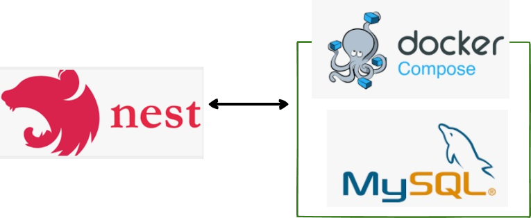
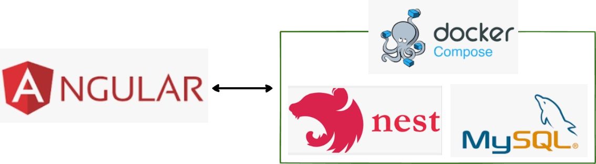
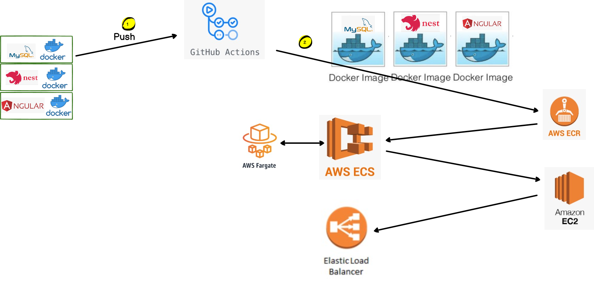

# CI/CD
## programs are developed by using docker.
* Database: Implemented from the database image (mysql, mongodb, postgress, etc.) in the hub.docker.com.
* Backend: Developed with nestjs, typeOrm (when developing RDBMS).
* Frontend: Development with Angular. 

-----
## CI
### Backend Development Method:
1. Only database is implemented with docker-compose.
2. When developing a backend program, it is developed in an environment that does not use docker.
3. During testing, data is transmitted and received from the database operating in the docker-compose method.

image 1.

-----

### Frontend  Development Method:
1. It is implemented with docker-compose by bundling the database and backend program.
2. Frontend program is developed in an environment that does not use docker.
3. During the test, the data is transmitted and received from the backend program, which is bundled by docker-compose.

image 2.

----
## CD

1. Committed and pushed frontend, backend and database programs to github. (image 3, no. 1)
2. By performing Github Acton, database image, backend image, and frontend image are created by the docker and github action pipeline and pushed to ECR (AWS docker image hub). (image 3, no. 2) 
3. Backend task: Backend Web program (image 3, no. 3)
4. Frontend task Frontend Web program (image 3, no. 4)
5. When a new image is updated in ECS by monitoring from ECR, current running application task is not automatically updated actually (to control the update time and to apply various variables). Two tasks run concurrently for a certain period of time.
6. When Docker images are pushed to ECR, the administrator must manually update the task for the modified program. When an update operation is in progress, the current running task is not stopped, as the original task remains working for a period of time, waiting for the new task to be updated, and then the old task is seamlessly replaced by the new task. While these background operations are in progress, users can continue their operations (web programs) without stopping.

image 3.

-----
## AWS 
### Cluster configuration: 
1. ECS cluster consists of two tasks in one cluster, and each task operates as a web program.. 
   * task 1:  
   container 1: backend server  (image 3, no. 3)  
              container 2: database  

   * task 2:  
   container 1: frontend (image 3, no. 4)

2. How it works: 
   * Database and backend operate as one web application.
   * Sending and receiving data from frontend web to backend web.

-----
### Considerations when connecting Backend program and Database
1. When developing locally, when the database and backend are implemented with docker-compose, the backend program uses the database's container name as the hostname to communicate with the database.
2. When setting for a CD (Continuous Deploy) task in AWS, the backend program can connect to the database by specifying the address of the database as localhost because the containers included in one task are implemented on the same network.
